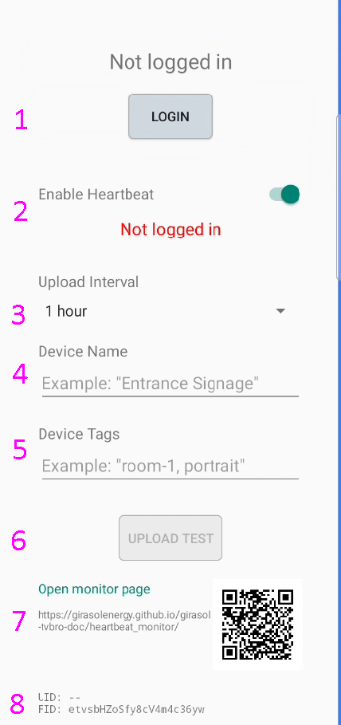

# Heartbeat Guide

## Overview

The Heartbeat feature periodically sends device status data to the Kanban Bro server.
You can check the running status using the dedicated Heartbeat Monitor: https://girasolenergy.github.io/girasol-tvbro-doc/heartbeat_monitor/

Using this feature requires user authentication (login) and enabling the feature.

* Table of contents
{:toc}

## How to use

You can use the Heartbeat feature with the following steps.

1. Sign in with a Google account
2. Enable the Heartbeat feature
3. Access the Heartbeat Monitor

## Heartbeat settings screen

### Accessing the Heartbeat settings screen

You can access the Heartbeat settings from the common settings screen.

### Layout of the Heartbeat settings screen

The image below shows the Heartbeat settings screen.

### 1: Sign in / Sign out

Sign in and sign out using a Google account.

If you are not signed in, the Heartbeat feature is not available.

### 2: Enable toggle

You can turn sending status data to the server on or off.

The status data includes a screenshot of the app at the time of sending, and the app's full state and settings.

To use the Heartbeat feature, switch it on.

### 3: Interval setting

You can set the interval at which status data is sent.

### 4: Title

You can set an arbitrary device name to be shown on the Heartbeat Monitor.

If not set, the FID (a unique ID per installation) will be shown.

### 5: Tags

You can optionally set tag strings used for filtering on the Heartbeat Monitor.

### 6: Test send

You can send one batch of data immediately to verify operation.

### 7: Link to Heartbeat Monitor

A link to the Heartbeat Monitor: https://girasolenergy.github.io/girasol-tvbro-doc/heartbeat_monitor/

### 8: Display of UID / FID

You can check UID (the currently signed-in user's ID) and FID (a unique ID per installation).
