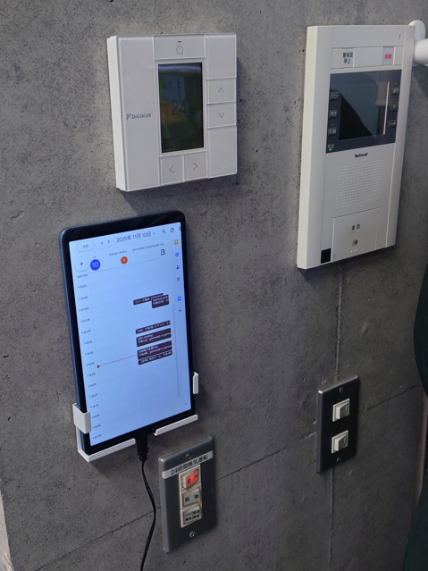
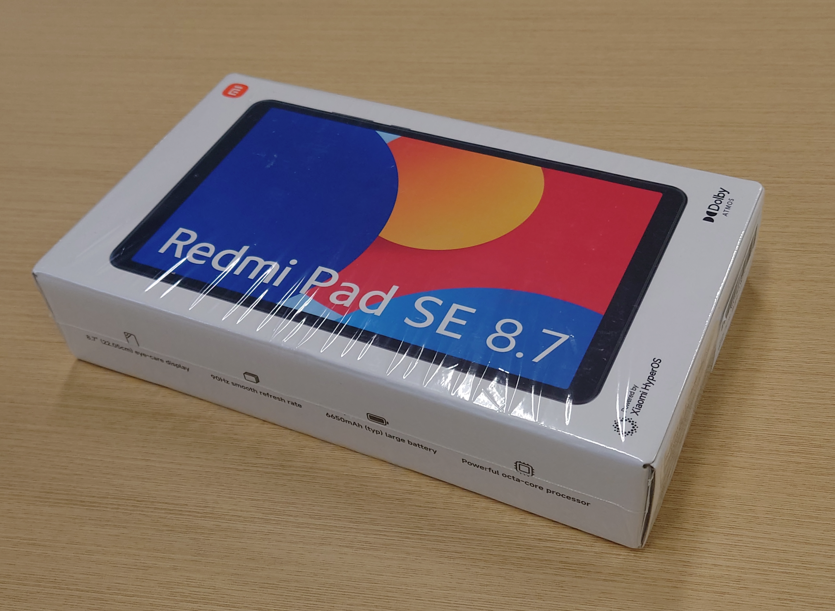
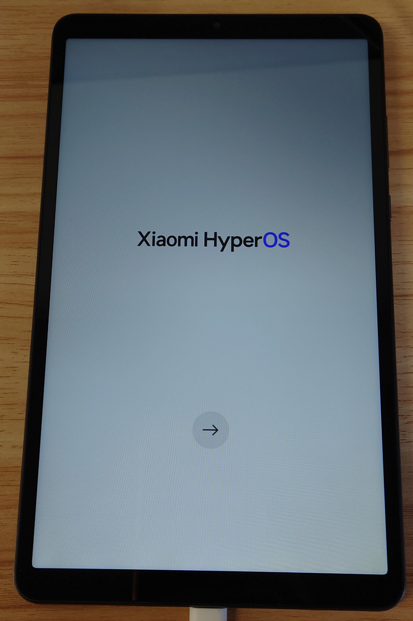
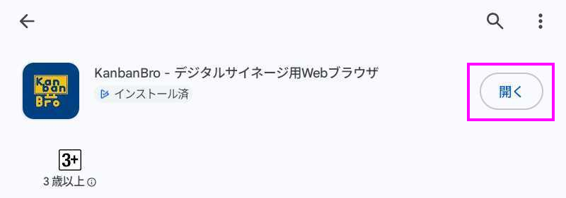
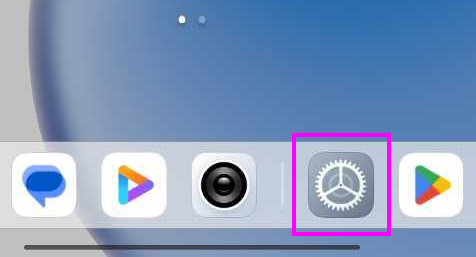
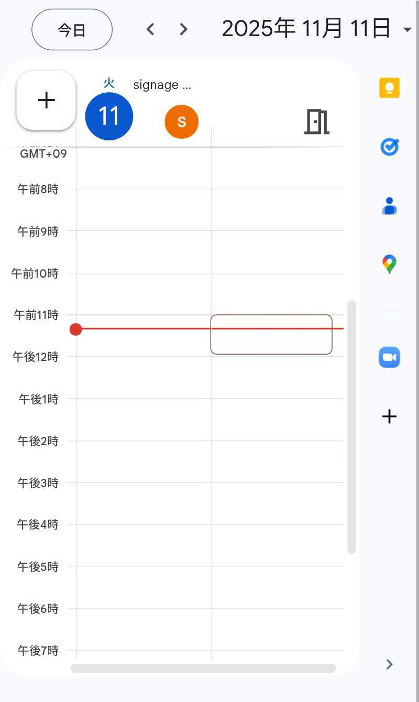

# Case Study: Meeting Room Schedule Signage at the Girasol Office Intercom

This is a deployment example of tablet-based signage placed beside the intercom at Girasol Energy Corporation’s office, showing the same-day meeting room booking timetable.

# Table of Contents

- dummy
{:toc}

# Deliverable

Signage that displays real-time meeting room booking status using Google Calendar.

## Installation Location

- Girasol Energy Corporation
- Entrepreneur Plaza 5F Head Office
- Wall next to the intercom

## Benefits

Previously, staff had to call out inside Office 501 to identify the visitor’s contact person. With immediate visibility of each meeting room’s reservation status, they can now quickly decide which floor to guide the visitor to.

# Components Used

- Xiaomi Android tablet
- Holder for wall mounting
- Google account for installation
- Production version of KanbanBro

# Procedure

## Purchase

Obtain the following product.

[Redmi-8-7インチディスプレイ-最大2TB拡張-低ブルーライト-最大輝度600nit](https://www.amazon.co.jp/dp/B0D97P58SS?th=1)

## Initial Device Setup

Perform the general initial setup of the tablet.

- Language: Japanese / Japan region
- Network: Configure as required for the environment
- Copy apps & data: Do not copy
- Google sign-in: Sign in with the Google account used on this device
- Google services: Leave all defaults
- Google services – Device backup: Turn backup ON
- Set screen lock: Skip
- Access Assistant with "OK Google": Skip
- Access Assistant without unlocking: Skip
- Continue additional setup?: No
- Basic settings: Leave defaults
- Set password: Skip
- Continue additional setup?: No

---

Then apply all available system updates.

## Install KanbanBro

Search Google Play for `KanbanBro`.

---

Install the paid or trial version of KanbanBro using the prescribed method.

## Additional Device Settings

Configure device settings so the KanbanBro screen remains constantly displayed.

---

- Lock screen > Sleep: Never
- Apps > KanbanBro – Signage Browser > Battery > Battery saver: Unrestricted
- Apps > KanbanBro – Signage Browser > Permissions > Pause app activity if unused: Off
- Apps > KanbanBro – Signage Browser > Additional permissions > Open new windows while running in background: Always allow

## Configure KanbanBro

When KanbanBro launches, its help page is shown.

---

Use the device’s Back action to open/close the KanbanBro menu.

### Device Behavior Settings via Bottom Buttons

From the bottom buttons, adjust settings to match the following.

---

- Auto reload: On, every 10 minutes
- Auto app restart: On, every 1 hour
- Auto app recovery: On, after 1 minute

When enabling Auto App Recovery, grant the “Display over other apps” permission when prompted.

## Display Google Calendar

### Restrict Tabs to Only Google Calendar

In KanbanBro, keep only the following Google Calendar URL open:

- https://calendar.google.com/calendar/u/0/r/day

Close the default tabs.

### Sign in to the Google Account

Sign in to the Google account when prompted, using the standard method.

### Adjust Tab Display Size

Open the viewport mode settings from the bottom buttons.

---

- Override tab settings: On
- Zoom factor: e.g. 150%

---

Close the viewport mode settings to apply the calendar display size.

## Wall Mounting

TODO
