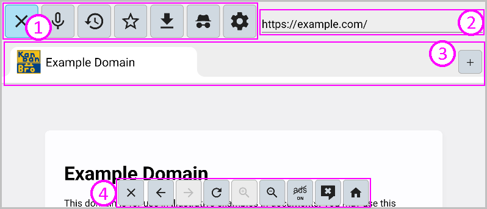
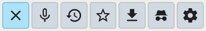
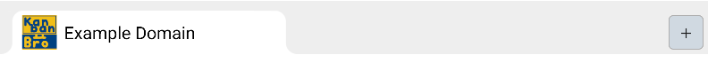
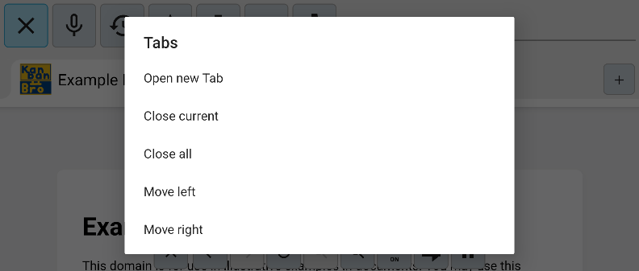

# Kanban Broドキュメント

* 目次
{:toc}

## メイン画面

1. メニューバー
2. アドレスバー
3. タブバー
4. 下部ボタンバー

メニューは戻るボタンで開閉します。

### メニューバー

ボタンから各種操作ができます。

- 閉じるボタン：アプリを閉じます。
- マイクボタン：マイクを起動します。
- 履歴ボタン：ページの閲覧履歴を呼び出します。
- ブックマークボタン：ブックマークメニューを呼び出します。
- ダウンロード履歴ボタン：ダウンロードの履歴を呼び出します。
- シークレットモードボタン：アプリをシークレットモードで再起動します。
- 設定ボタン：設定画面を開きます。

### アドレスバー

現在開いているタブのアドレスが表示されます。

ここからWebサイトのアドレスを入力したり、検索ができます。

### タブバー

現在開いているタブの一覧が表示されます。

タブを切り替えると前に開いていたタブのページはアンロードされます。

右端の＋ボタンで新しいタブを開きます。

---

タブを長タップするとタブのコンテキストメニューが開きます。

### 下部ボタンバー

- 閉じるボタン：現在開いているタブを閉じます。
- 戻るボタン：一つ前のページに遷移します。
- 進むボタン：一つ後のページに遷移します。
- 更新ボタン：ページを更新します。
- 広告ブロックボタン：広告ブロッカーの有効状態を切り替えます。
- ポップアップブロックボタン：ポップアップのブロックを設定します。
- ホームボタン：ホームを表示します。

## 設定画面

■■TODO ここを埋めるには先にKanbanBroの日本語化をした方がよい■■

## 個別機能説明

- [リモート監視（Heartbeat）機能ガイド](ja/heartbeat.md)
