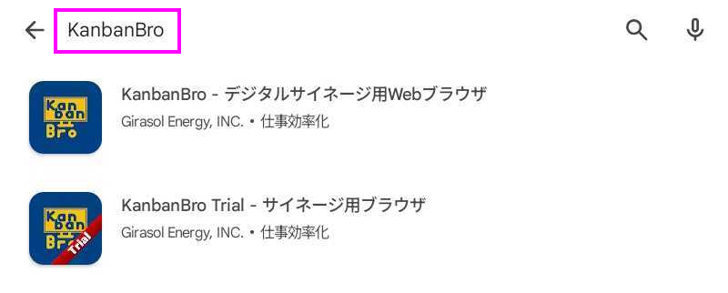
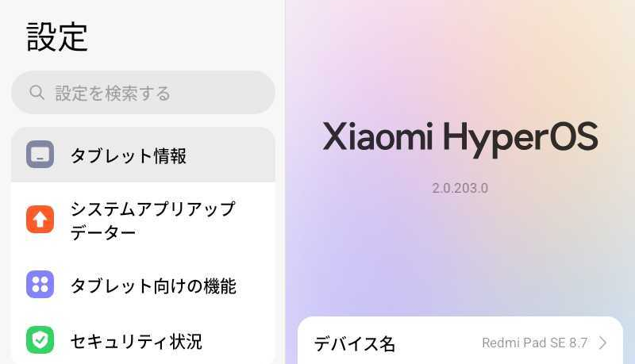
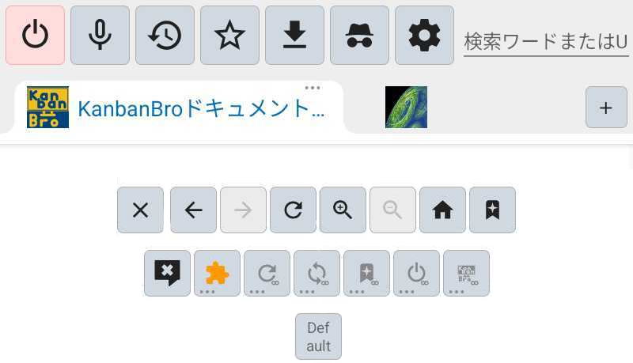
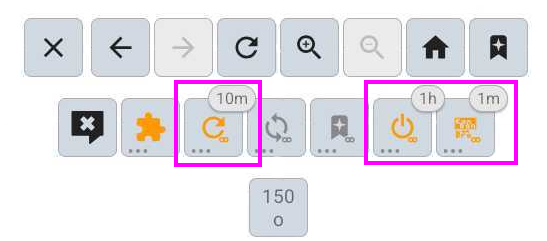
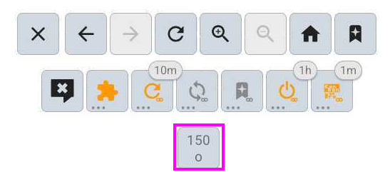

# ヒラソルオフィスインターホン前会議室予約表サイネージ設置事例

これはヒラソル・エナジー株式会社のオフィスのインターホン前に設置されている、当日の会議室等の予約の時間割をタブレットで表示するサイネージの設置事例です。

# 目次

- dummy
{:toc}

# 成果物

Googleカレンダーで会議室の利用予約状況をリアルタイムで表示するサイネージ

## 設置場所

- ヒラソル・エナジー株式会社
- アントレプレナープラザ5階本社オフィス
- インターホン横の壁

## 得られたこと

従来は来客時に501のオフィス内で呼び掛けて誰に会いに来た来客か確認していたが、
各会議室の予約状況がその場ですぐに分かることで、
どの階に案内すればよいかすぐに決定できるようになった。

# 使ったもの

- XiaomiのAndroidタブレット
- 壁に設置するためのホルダー
- インストール用のGoogleアカウント
- 製品版KanbanBro

# 手順

## 購入

次の製品を入手します。

[Redmi-8-7インチディスプレイ-最大2TB拡張-低ブルーライト-最大輝度600nit](https://www.amazon.co.jp/dp/B0D97P58SS?th=1)

## 初期設定

タブレットの一般的な初期設定を行います。

- 言語設定: 日本語・日本地域
- 通信設定: その環境で必要な設定を行います。
- アプリとデータのコピー: コピーしない
- Googleログイン: この端末で使うGoogleアカウントにログインします。
- Googleサービス: すべてデフォルトの状態
- Googleサービス: デバイスのバックアップ: バックアップをONにする
- 画面ロックを設定: スキップ
- 「OK Google」でアシスタントにアクセス: スキップ
- デバイスのロックを解除しないでアシスタントにアクセス: スキップ
- さらに設定を続けますか？: いいえ
- 基本設定: すべてデフォルトの状態
- パスワードを設定: スキップ
- さらに設定を続けますか？: いいえ

---

更にシステムアップデートを一通り行います。

## KanbanBroのインストール

Google Playで `KanbanBro` で検索します。

---

所定の手段で有償版もしくはTrial版のKanbanBroをインストールします。

## 追加の端末設定

常にKanbanBroの画面を表示し続けるための端末側の設定を行います。

---

- ロック画面＞スリープ: しない
- アプリ＞KanbanBro - サイネージ向けブラウザ＞バッテリー＞バッテリーセーバー: 制限なし
- アプリ＞KanbanBro - サイネージ向けブラウザ＞アクセス許可＞未使用の場合はアプリのアクティビティを一時停止する: オフ
- アプリ＞KanbanBro - サイネージ向けブラウザ＞その他の権限＞バックグラウンドで実行中に新しいウィンドウを開く: 常に許可

## KanbanBroの設定

KanbanBroを起動すると、ヘルプページが表示された状態になります。

---

端末の「戻る」操作を行うとKanbanBroのメニューを開閉できます。

### 下部ボタンからの端末動作設定

下部ボタンから設定を行い、以下の表示にします。

---

- 自動再読み込み: オン、10分
- 自動アプリ再起動: オン、1時間
- 自動アプリ復帰: オン、1分

「自動アプリ復帰」機能の利用には「他のアプリの上に重ねて表示」の権限の許可が求められるため、許可します。

## Googleカレンダーの表示

### タブ構成をGoogleカレンダーのみに変更

KanbanBroで以下のURLのGoogleカレンダーのみを開いた状態にします。

- https://calendar.google.com/calendar/u/0/r/day

デフォルトで開かれているタブは閉じます。

### Googleアカウントへのログイン

Googleアカウントへのログインが求められるため、既定の手段でログインします。

### タブの表示サイズ設定

下部ボタンからビューポートモード設定を開きます。

---

- タブの設定を上書き: オン
- 拡大率の数値: 150%など

---

ビューポートモード設定を閉じるとカレンダーの表示サイズが調整されます。

## 壁に設置

TODO
