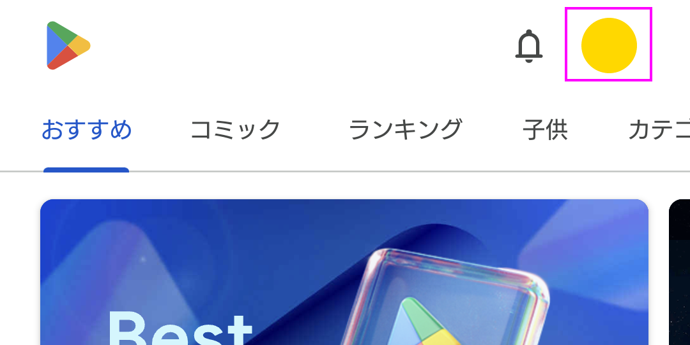
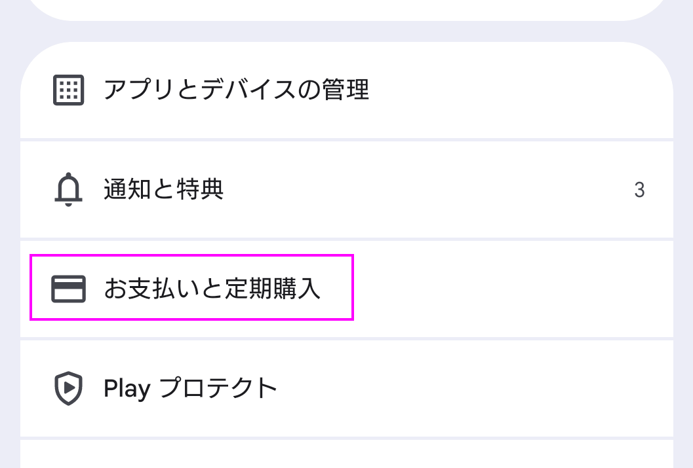
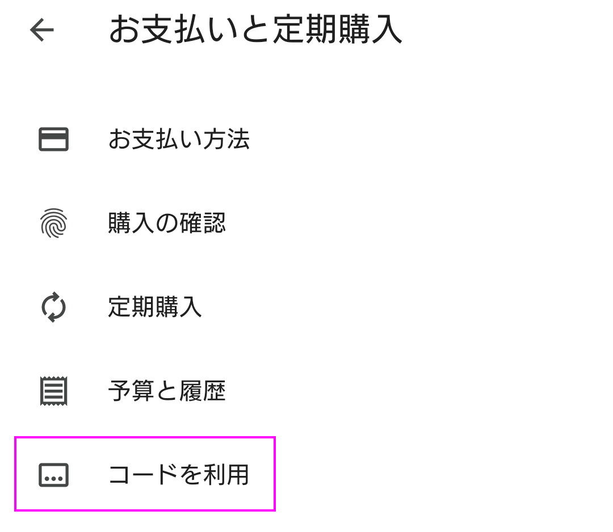
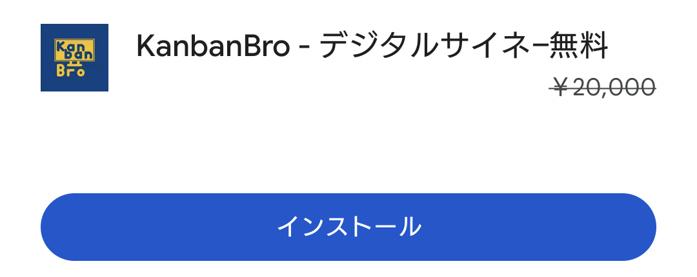

# プロモーションコード利用ガイド

## 手順

### プロモーションコードを入手する

プロモーションコードを入手します。

プロモーションコードは `123456789ABCDEFGHIJKLMN` のような英大文字と数字で構成された23文字のコードです。

### プロモーションコードを入力する

まず、Google Playの右上のアカウントのアイコンからアカウントの管理画面に遷移します。

---

アカウントの管理画面上で「お支払いと定期購入」を選択します。

---

「コードの利用」を選択します。

---

プロモーションコードを入力すると、KanbanBroが無料で入手可能になります。

